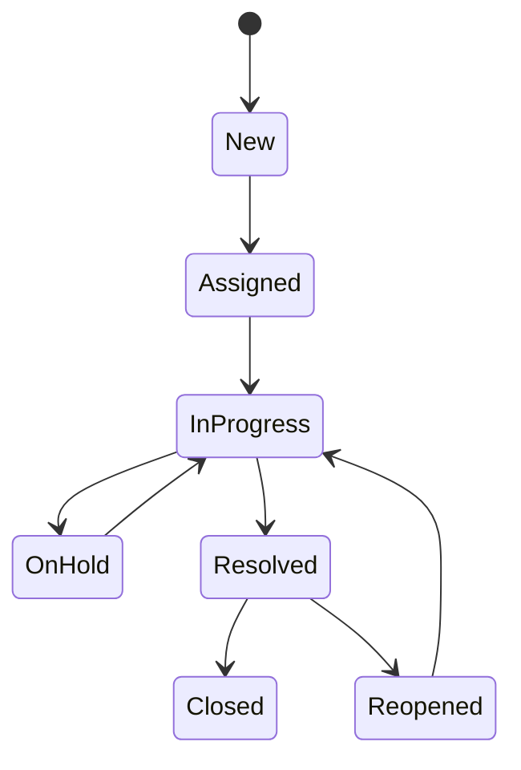

# Use Cases and Business Rules

## UC-01 — Create Service Request

**Primary actor:** Employee  
**Precondition:** Employee is authenticated.

### Main Flow

1. Employee selects **New Request**.
2. Portal displays the request form.
3. Employee selects category and subcategory.
4. Employee enters title, description and impact.
5. Portal validates required information.
6. Portal creates a unique request number.
7. Portal calculates priority and routes the request.
8. Portal displays confirmation and sends notification.

### Alternate Flows

- Missing required field: portal highlights the field and does not submit.
- Inactive category: category is not available for selection.
- Notification failure: request remains created and notification failure is logged.

## UC-02 — Resolve Service Request

**Primary actor:** Resolver  
**Precondition:** Request is assigned and not closed.

### Main Flow

1. Resolver opens the assigned request.
2. Resolver reviews details and history.
3. Resolver completes required work.
4. Resolver enters a resolution summary.
5. Resolver changes status to `Resolved`.
6. Portal records user and timestamp.
7. Employee receives a resolution notification.

## Business Rules

| ID | Rule |
|---|---|
| BR-01 | Request number must be unique and system-generated. |
| BR-02 | Priority is calculated from impact and urgency using an approved matrix. |
| BR-03 | Every active request must have a resolver group. |
| BR-04 | Only authorized roles may view internal comments. |
| BR-05 | `On Hold` requires a hold reason. |
| BR-06 | `Resolved` requires a resolution summary. |
| BR-07 | `Closed` requests cannot be edited except through an authorized reopen action. |
| BR-08 | Users may not access requests outside their permitted scope. |

## Status Transitions

