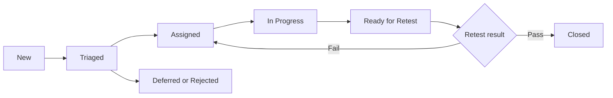

# Defect Management

## Required Defect Fields

- Defect ID and concise title
- Environment and build/version
- Related requirement, story and test scenario
- Preconditions and test data
- Reproduction steps
- Expected result
- Actual result
- Severity and priority
- Evidence such as screenshot or log reference
- Assignee, status and target release

## Severity Definitions

| Severity | Definition | Example |
|---|---|---|
| Severity 1 — Critical | UAT cannot continue or critical business/security failure has no workaround. | Unauthorized access to restricted requests |
| Severity 2 — High | Major business function fails and no reasonable workaround exists. | Valid request cannot be submitted |
| Severity 3 — Medium | Function works incorrectly but an acceptable workaround exists. | Filter returns incomplete results |
| Severity 4 — Low | Minor issue with limited business impact. | Label, alignment or non-blocking wording issue |

## Defect Lifecycle

## Triage Guidelines

1. Confirm the issue is reproducible.
2. Link the defect to requirement and UAT scenario.
3. Agree severity based on business impact.
4. Set priority based on severity, frequency, workaround and release risk.
5. Assign an owner and target build.
6. Record decisions and accepted risks.

## UAT Reporting

Daily UAT status should include:

- Scenarios planned, executed, passed, failed and blocked
- Pass rate
- Open defects by severity and status
- Requirements not yet validated
- New risks or blockers
- Planned retests and next actions

## Sign-Off Rule

UAT sign-off requires closure of all Severity 1 and Severity 2 defects. Lower-severity defects may remain only with documented owner, target date, business acceptance and workaround where applicable.
